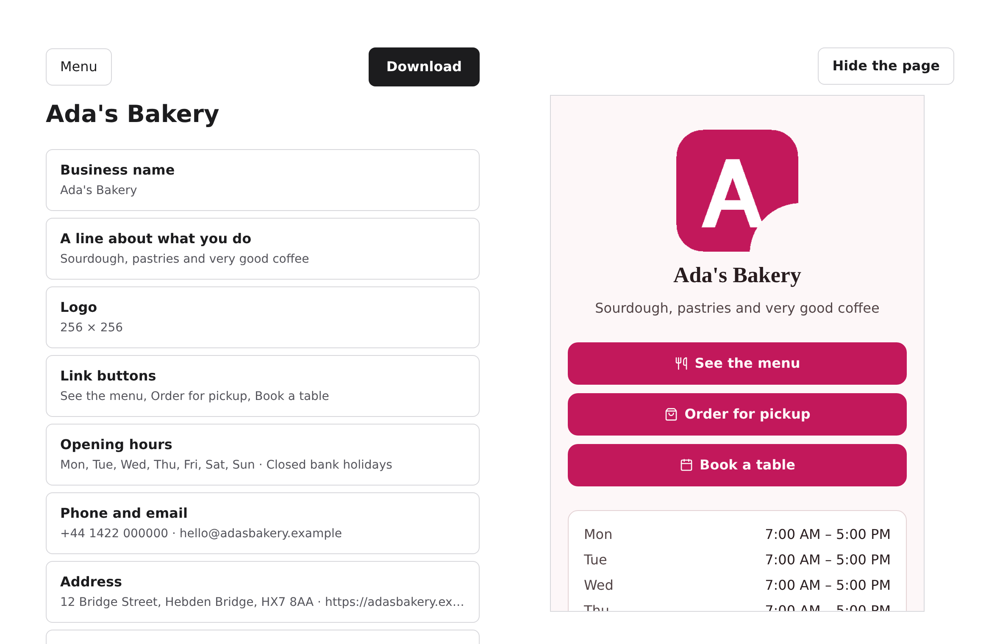
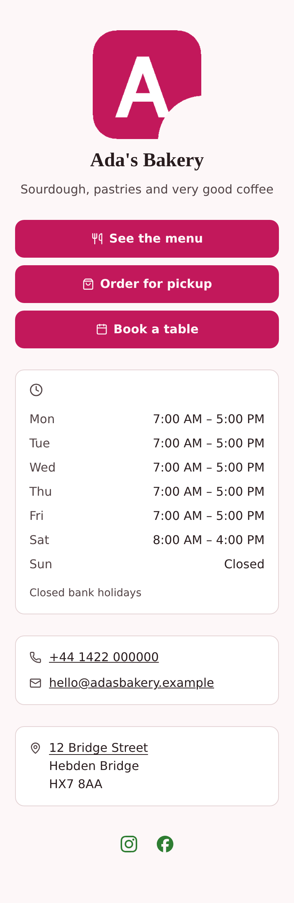

# linkpage

Build a business link page in your browser. Export **one self-contained HTML file**. Put it anywhere.



- **No accounts, no backend, nothing to install.** There are no servers, so there is nothing to sign
  up for and nothing to shut down.
- **One file out.** CSS and images inlined, **zero JavaScript**. Drag it onto a free host, or email
  it to whoever runs your website.
- **Works offline**, opens straight from a folder, and cannot break later.
- **Built for businesses**, not just creators: hours, address, phone and social alongside the links.

> **Status:** v1 is built, tested and live. **[Try it](https://mandymoorefan.github.io/linkpage/)** —
> every push to `main` publishes. 1,200+ tests behind it, plus a browser end-to-end that downloads
> the file and opens it with the network off.

## Run it

```bash
corepack enable && pnpm install && pnpm dev
```

Node 22.12+ (`.nvmrc` pins 24).

## What it exports



One `index.html`. That screenshot is the whole file — there is no second request.

## Deliberately not doing

Click analytics, contact forms, custom domains, multi-page sites — each ruled out by the no-backend
constraint rather than by taste. [CONTRIBUTING.md](./CONTRIBUTING.md) has the reasoning, plus the
three invariants CI enforces.

## How it fits together

```
packages/renderer   render(project) → the complete text of your index.html.
                    Plain TypeScript, zero dependencies. The artifact contract.
packages/builder    React + Vite editing app. Previews by putting the renderer's
                    output in an iframe, so the preview is the export.
```

**[SPEC.md](./SPEC.md) is the complete design** — enough to rebuild v1 from, including why each
rejected option was rejected.

## License

[MIT](./LICENSE). By participating you agree to the [Code of Conduct](./CODE_OF_CONDUCT.md).
